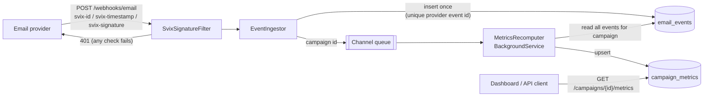

# webhook-ingest


An ASP.NET Core (.NET 10) service that receives signed webhooks from an email provider. It checks each signature, stores each event exactly once, and keeps engagement metrics for every campaign up to date.

**Background:** A .NET rebuild of a webhook pipeline I originally wrote in JavaScript for my own coaching business.

## What it does

- **Verifies** [Svix-style](https://docs.svix.com/receiving/verifying-payloads/how-manual) signatures (`svix-id`, `svix-timestamp`, `svix-signature`). The signature is an HMAC-SHA256 over `id.timestamp.body`. The check uses a constant-time comparison, accepts multiple signatures in one header, and rejects timestamps more than 5 minutes off to block replays.
- **Stores each event once.** A unique index on the provider's message id means that when a provider retries a delivery, the request still gets `200` but nothing new is stored.
- **Recomputes metrics** for a campaign in a background service, from all of that campaign's stored events: sent, delivered, opens (unique and total), clicks (unique and total), bounced, complained, and unsubscribed.
- **Serves** the current metrics at `GET /campaigns/{id}/metrics`, plus `/health` and an OpenAPI document.

## Architecture



| Folder | Responsibility |
| --- | --- |
| `Signatures/` | `SvixSignatureVerifier` (pure, clock injected through `TimeProvider`) and the endpoint filter that applies it |
| `Ingestion/` | Payload contract, `EventIngestor` (parse, dedupe, store, enqueue), `POST /webhooks/email` |
| `Metrics/` | `MetricsCalculator` (pure), the coalescing `Channel<T>` queue, the background recomputer, `GET` endpoint |
| `Data/` | EF Core model and provider selection (SQLite or SQL Server) |

## Run locally

Requires the [.NET 10 SDK](https://dotnet.microsoft.com/download).

```bash
cd src/WebhookIngest
dotnet user-secrets set WebhookSigning:SigningSecret "whsec_$(openssl rand -base64 32)"
dotnet run
```

The API listens on `http://localhost:5080`, and the OpenAPI document is at `/openapi/v1.json`. If no signing secret is configured, the app refuses to start.

By default it writes to a local SQLite file. To use SQL Server:

```bash
export Database__Provider=SqlServer
export ConnectionStrings__Events="Server=localhost;Database=WebhookIngest;Trusted_Connection=True;TrustServerCertificate=True"
```

## API examples

curl can't compute an HMAC by itself, so `scripts/send-sample-event.sh` builds and signs a synthetic event with `openssl`, then sends it with curl:

```bash
export WEBHOOK_SECRET="<the secret you set above>"
./scripts/send-sample-event.sh email.delivered cmp_demo reader@example.com
./scripts/send-sample-event.sh email.opened    cmp_demo reader@example.com
```

```http
HTTP/1.1 200 OK
Content-Type: application/json; charset=utf-8

{"status":"stored"}
```

Sending the same `svix-id` again returns `{"status":"duplicate"}`. A bad or stale signature returns `401` with an empty body.

```bash
curl -s http://localhost:5080/campaigns/cmp_demo/metrics
```

```json
{
  "campaignId": "cmp_demo",
  "sent": 0,
  "delivered": 1,
  "uniqueOpens": 1,
  "totalOpens": 1,
  "uniqueClicks": 0,
  "totalClicks": 0,
  "bounced": 0,
  "complained": 0,
  "unsubscribed": 0,
  "lastEventAt": "2026-09-17T13:24:58+00:00",
  "recomputedAt": "2026-09-17T13:24:58.2107749+00:00"
}
```

Event payload shape:

```json
{
  "type": "email.opened",
  "created_at": "2026-03-02T14:10:00Z",
  "data": { "campaign_id": "cmp_demo", "recipient": "reader@example.com" }
}
```

## Design decisions and trade-offs

- **Verify raw bytes before parsing.** The signature covers the exact bytes that were sent. The filter therefore reads the body itself, with a size cap, and verifies it before any JSON binding. Model binding could re-serialize the body and break the signature.
- **Say nothing about why a request failed.** Every failed check returns the same bare `401`, and the specific reason is only logged server-side. Comparisons use `CryptographicOperations.FixedTimeEquals`.
- **The database enforces idempotency.** A quick `AnyAsync` check handles the common retry case. If two identical deliveries race past that check, the unique index lets only one row in, and the loser is reported as a duplicate.
- **Recompute metrics instead of incrementing them.** Every update rebuilds a campaign's counts from its stored events. Out-of-order events, duplicates, and a failed update all correct themselves on the next run. This costs a read of the campaign's events on each update, which suits per-campaign volumes. A very large campaign would need incremental aggregates or a periodic batch job.
- **Use an in-memory channel, not a message broker.** `Channel<T>` keeps the service to a single deployable unit. If the process crashes, it can lose queued recompute requests but never stored events, and a startup reconciliation pass recomputes every campaign. When a burst of events arrives for one campaign, they collapse into a single recompute.
- **Keep one writer for metrics.** Only the background service writes to `campaign_metrics`, so there are no competing upserts.
- **Use `EnsureCreated` instead of migrations.** Supporting two database providers would mean two migration sets. For a demo this keeps setup to a single `dotnet run`. A real deployment would use migrations for each provider.
- **Count people, not events.** Most metrics count distinct recipients, and opens and clicks also keep raw totals. Unknown event types are stored, so nothing is lost, but they don't affect any count.

## Tests

```bash
dotnet test
```

- **Unit tests (34)** cover:
  - the signature verifier: the published Svix test vector, tampered body, wrong secret, wrong message id, expired and future timestamps, the edges of the tolerance window, multiple signatures, and malformed headers
  - the metrics calculator: distinct counts, repeated events, independence from event order, unknown event types
  - batching in the queue
- **Integration tests (12)** use `WebApplicationFactory` with a temporary SQLite database. They cover:
  - a signed event is stored
  - a duplicate delivery is stored once
  - a wrong secret, a stale timestamp, or a missing signature returns `401`
  - invalid payloads return `400`
  - `/health` works
  - out-of-order events flow end to end into the correct metrics
  - duplicates don't change the metrics

CI runs build, test, `dotnet format --verify-no-changes`, and a gitleaks secret scan on every push.

## License

[MIT](LICENSE)
